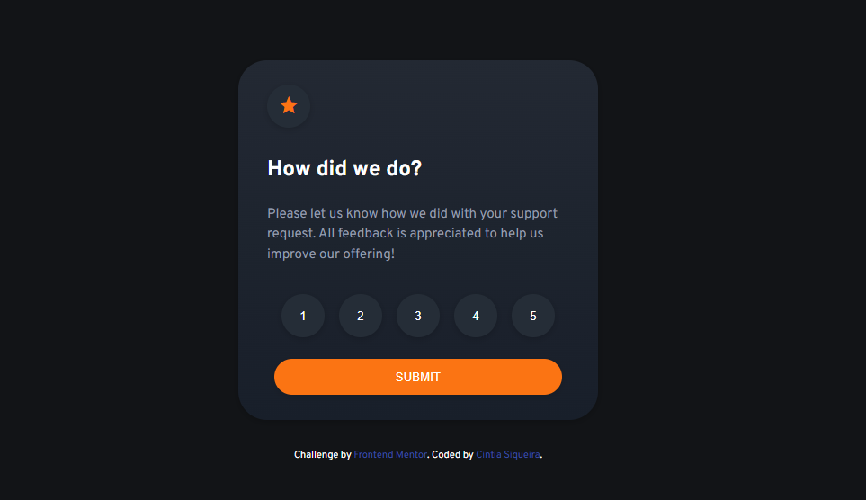
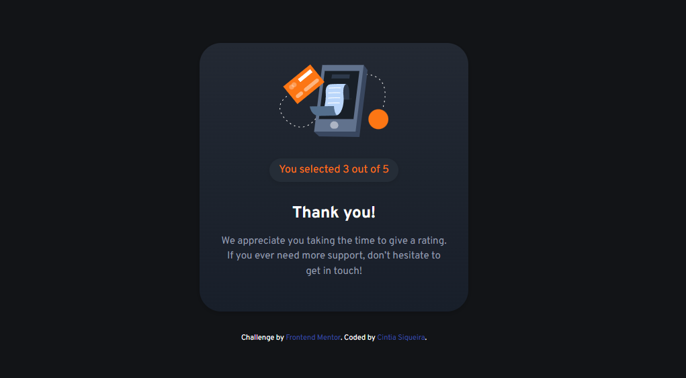

# Frontend Mentor - Interactive rating component solution

This is a solution to the [Interactive rating component challenge on Frontend Mentor](https://www.frontendmentor.io/challenges/interactive-rating-component-koxpeBUmI). Frontend Mentor challenges help you improve your coding skills by building realistic projects.

## Table of contents

- [Overview](#overview)
  - [The challenge](#the-challenge)
  - [Screenshot](#screenshot)
  - [Links](#links)
- [My process](#my-process)
  - [Built with](#built-with)
  - [What I learned](#what-i-learned)
  - [Continued development](#continued-development)
  - [Useful resources](#useful-resources)
- [Author](#author)
- [Acknowledgments](#acknowledgments)

## Overview

### The challenge

Users should be able to:

- View the optimal layout for the app depending on their device's screen size
- See hover states for all interactive elements on the page
- Select and submit a number rating
- See the "Thank you" card state after submitting a rating

### Screenshot

<br>


### Links

- Solution URL: [Add solution URL here](https://github.com/ciisiq/challenge-interactive-rating)
- Live Site URL: [Add live site URL here](https://ciisiq.github.io/challenge-interactive-rating/)

## My process

### Built with

- Plain Javascript with DOM manipulation
- CSS
- Flexbox

### What I learned

Recap again the DOM manipulation, thinking about the simple way to make this done without overthink. Learned about whitespace in HTML, letter-spacing in CSS, not to use a:active for to change a colour of a my rating buttons and yes use focus. Training my eyes to copy a Design without the design guide.

```css
a:focus {
  color: orange;
}
```

```js
function submitRating() {
  if (clicked) {
    ratingCard.style.display = "none";
    thanksCard.style.display = "block";
    userRating.textContent = valueRating;
```

### Continued development

### Useful resources

- [resource 1](<https://www.geeksforgeeks.org/hide-or-show-elements-in-html-using-display-property/#:~:text=To%20show%20an%20element%2C%20set,getElementById(%22element%22).>) - Where I understand more about style.display propriety in DOM manipulation
- [resource 2](https://stackoverflow.com/questions/65767120/get-value-of-the-clicked-button-javascript) - Where I got hot to get a user rating value for DOM;
- [Resource 3](https://developer.mozilla.org/en-US/docs/Web/CSS/:focus) - Where I got the information about link focus
- [Resource 4](https://blog.hubspot.com/website/html-space#:~:text=The%20simplest%20way%20to%20add,words%20or%20other%20page%20elements.) - about whitespace in HTML

## Author

- Website - [Cintia Siqueira](https://cisiq.dev/)
- Frontend Mentor - [@ciisiq](https://www.frontendmentor.io/profile/ciisiq)
- Twitter - [@cii_siq](https://twitter.com/Cii_siq)

## Acknowledgments

creating simple things is also important, keep going!
